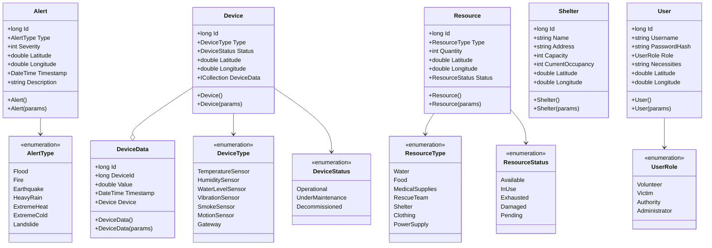
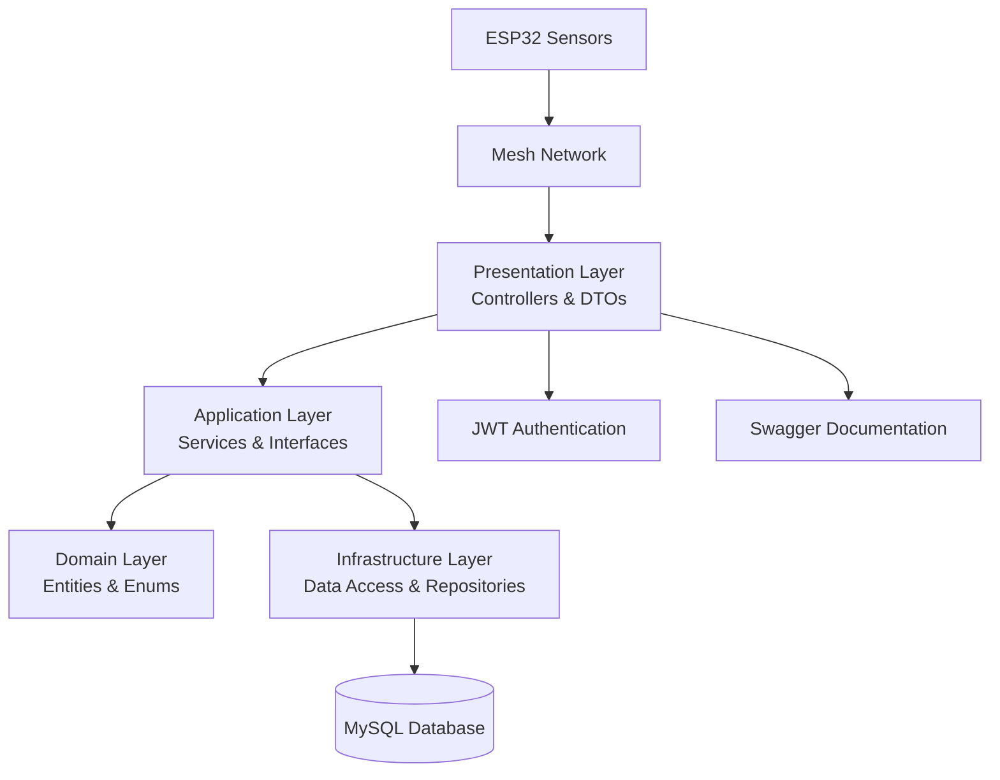

# 🛡️ Disaster Shield API

Sistema de Coordenação de Emergência Distribuído que atua como uma solução corretiva para situações onde previsões da defesa civil ou outras autoridades podem falhar. O sistema utiliza sensores ESP32 em rede mesh para monitorar dados ambientais como nível de água, fumaça e outros indicadores críticos, processando automaticamente essas informações para gerar alertas em caso de anormalidades, e para ajudar comunidades em risco.

## ▶️ Links para vídeos
- [Link para vídeo de .NET](https://youtu.be/RgPryi2EXLA)
- [Link para vídeo de DEVOPS](https://youtu.be/mWOL7gt8PQA)
- [Link para PITCH](https://youtu.be/8D1A1Ji5vlc)

## 🚀 Funcionalidades

- **Monitoramento em Tempo Real**: Coleta dados de sensores ESP32 via rede mesh
- **Sistema de Alertas Automático**: Geração automática de alertas baseado em dados dos sensores
- **Gestão de Recursos**: Criação e gerenciamento de recursos por voluntários e autoridades
- **Gestão de Abrigos**: Administração de abrigos de emergência (apenas autoridades)
- **Localização de Emergência**: Mapa para vítimas localizarem recursos e abrigos próximos
- **Sistema de Autenticação**: Controle de acesso baseado em roles (Volunteer, Victim, Authority, Administrator)
- **Dashboard de Estatísticas**: Visualização de dados e tendências em tempo real

## 🏗️ Arquitetura do Sistema

### Diagrama de Classes



### Arquitetura de Camadas



## 📋 Pré-requisitos

- [.NET 8 SDK](https://dotnet.microsoft.com/download/dotnet/8.0)
- [Docker](https://www.docker.com/get-started)
- [Git](https://git-scm.com/)

## 🛠️ Instalação

### 1. Clone o Repositório

```bash
git clone https://github.com/correialeo/SCED.API.git
cd SCED.API
```

### 2. Configure o Banco de Dados MySQL

#### Opção A: Docker (Recomendado)

**Linux/macOS:**
```bash
docker run --name mysql-server-gs \
  -e MYSQL_USER=dev \
  -e MYSQL_DATABASE=DisasterShield \
  -e MYSQL_PASSWORD=dev \
  -e MYSQL_ROOT_PASSWORD=dev \
  -p 3365:3306 \
  -d mysql
```

**Windows (PowerShell):**
```powershell
docker run --name mysql-server-gs `
  -e MYSQL_USER=dev `
  -e MYSQL_DATABASE=DisasterShield `
  -e MYSQL_PASSWORD=dev `
  -e MYSQL_ROOT_PASSWORD=dev `
  -p 3365:3306 `
  -d mysql
```

**Windows (CMD):**
```cmd
docker run --name mysql-server-gs ^
  -e MYSQL_USER=dev ^
  -e MYSQL_DATABASE=DisasterShield ^
  -e MYSQL_PASSWORD=dev ^
  -e MYSQL_ROOT_PASSWORD=dev ^
  -p 3365:3306 ^
  -d mysql
```

#### Opção B: MySQL Local
Se preferir instalar o MySQL localmente, certifique-se de criar um banco chamado `DisasterShield` e configurar as credenciais conforme o arquivo `.env.example`.

### 3. Configure as Variáveis de Ambiente

Copie o arquivo `.env.example` para `.env`:

**Linux/macOS:**
```bash
cp .env.example .env
```

**Windows:**
```cmd
copy .env.example .env
```

O arquivo `.env.example` já contém as configurações corretas para o container Docker:

```env
DATABASE__SERVER='127.0.0.1'
DATABASE__NAME='DisasterShield'
DATABASE__PORT='3365'
DATABASE__USER='dev'
DATABASE__PASSWORD='dev'
```

### 4. Restaure as Dependências

```bash
dotnet restore
```

### 5. Configure o Banco de Dados

Instale o EF na versão 8.0.16:
```bash
dotnet tool install --global dotnet-ef --version 8.0.16
```

Aplique as migrations para criar as tabelas:

```bash
dotnet ef database update
```

### 6. Execute a Aplicação

```bash
dotnet run
```

A API estará disponível em `http://localhost:5046` (ou a porta configurada).

## 📖 Documentação da API

### Acesso ao Swagger

Após iniciar a aplicação, acesse `http://localhost:5046/swagger` para explorar e testar os endpoints interativamente.

### Sistema de Autenticação

O sistema utiliza autenticação JWT com diferentes roles de usuário. Para acessar os endpoints protegidos:

#### 1. Registrar um Usuário

**POST** `/api/Auth/register`

```json
{
  "username": "maria.santos",
  "password": "MinhaSenh@Segura123",
  "role": "Volunteer",
  "necessities": "Preciso de água potável e alimentos não perecíveis",
  "latitude": -23.5505,
  "longitude": -46.6333
}
```

**Roles Disponíveis:**
- `Volunteer` - Voluntários (podem criar recursos)
- `Victim` - Vítimas (acesso a recursos e abrigos)
- `Authority` - Autoridades (podem criar recursos e abrigos)
- `Administrator` - Administradores (acesso completo)

#### 2. Fazer Login

**POST** `/api/Auth/login`

Após o login, você receberá um token JWT. Copie-o.

#### 3. Autorizar no Swagger

No Swagger, clique no botão **"Authorize"** e insira:
```
Bearer {seu_token_aqui}
```

## 🛣️ Endpoints Principais

### 🚨 Alertas
| Método | Endpoint | Descrição |
|--------|----------|-----------|
| GET | `/api/Alerts` | Listar todos os alertas |
| POST | `/api/Alerts` | Criar novo alerta |
| GET | `/api/Alerts/{id}` | Buscar alerta por ID |
| PUT | `/api/Alerts/{id}` | Atualizar alerta |
| DELETE | `/api/Alerts/{id}` | Remover alerta |
| GET | `/api/Alerts/type/{type}` | Filtrar por tipo |
| GET | `/api/Alerts/severity/{severity}` | Filtrar por severidade |
| GET | `/api/Alerts/radius` | Buscar por raio |
| GET | `/api/Alerts/recent` | Alertas recentes |

### 🔐 Autenticação
| Método | Endpoint | Descrição |
|--------|----------|-----------|
| POST | `/api/Auth/login` | Fazer login |
| POST | `/api/Auth/register` | Registrar usuário |
| POST | `/api/Auth/validate` | Validar token |
| POST | `/api/Auth/logout` | Fazer logout |

### 📊 Dados dos Dispositivos
| Método | Endpoint | Descrição |
|--------|----------|-----------|
| POST | `/api/DeviceData` | Receber dados do sensor |
| GET | `/api/DeviceData/{deviceId}` | Histórico do dispositivo |
| GET | `/api/DeviceData/{deviceId}/period` | Dados por período |
| GET | `/api/DeviceData/{deviceId}/latest` | Último dado registrado |
| GET | `/api/DeviceData/{deviceId}/value/{value}` | Dados acima de valor |

### 🔧 Dispositivos
| Método | Endpoint | Descrição |
|--------|----------|-----------|
| GET | `/api/Devices` | Listar dispositivos |
| POST | `/api/Devices` | Cadastrar dispositivo |
| GET | `/api/Devices/{id}` | Buscar por ID |
| PUT | `/api/Devices/{id}` | Atualizar dispositivo |
| DELETE | `/api/Devices/{id}` | Remover dispositivo |
| GET | `/api/Devices/type/{type}` | Filtrar por tipo |
| GET | `/api/Devices/status/{status}` | Filtrar por status |
| GET | `/api/Devices/radius` | Buscar por raio |

### 📦 Recursos
| Método | Endpoint | Descrição |
|--------|----------|-----------|
| GET | `/api/Resources` | Listar recursos |
| POST | `/api/Resources` | Criar recurso |
| GET | `/api/Resources/{id}` | Buscar por ID |
| PUT | `/api/Resources/{id}` | Atualizar recurso |
| DELETE | `/api/Resources/{id}` | Remover recurso |
| GET | `/api/Resources/type/{type}` | Filtrar por tipo |
| GET | `/api/Resources/available` | Recursos disponíveis |
| GET | `/api/Resources/status/{status}` | Filtrar por status |
| GET | `/api/Resources/nearby` | Recursos próximos |

### 🏠 Abrigos
| Método | Endpoint | Descrição |
|--------|----------|-----------|
| GET | `/api/Shelters` | Listar abrigos |
| POST | `/api/Shelters` | Criar abrigo |
| GET | `/api/Shelters/{id}` | Buscar por ID |
| PUT | `/api/Shelters/{id}` | Atualizar abrigo |
| DELETE | `/api/Shelters/{id}` | Remover abrigo |
| GET | `/api/Shelters/available` | Abrigos disponíveis |
| GET | `/api/Shelters/nearby` | Abrigos próximos |
| GET | `/api/Shelters/capacity-range` | Por faixa de capacidade |
| PATCH | `/api/Shelters/{id}/capacity` | Atualizar ocupação |

### 📈 Estatísticas
| Método | Endpoint | Descrição |
|--------|----------|-----------|
| GET | `/api/Statistics/dashboard` | Obtém as estatísticas completas do dashboard |
| GET | `/api/Statistics/locations` | Obtém estatísticas de alertas agrupadas por localização geográfica |
| GET | `/api/Statistics/device-types` | Obtém estatísticas dos dispositivos agrupadas por tipo |
| GET | `/api/Statistics/alert-trends` | Obtém as tendências temporais dos alertas |
| GET | `/api/Statistics/hotspots` | Obtém os hotspots geográficos com maior concentração de alertas |
| POST | `/api/Statistics/realtime-update` | Atualiza as estatísticas em tempo real com novos dados de dispositivo |

### 👤 Usuários
| Método | Endpoint | Descrição |
|--------|----------|-----------|
| GET | `/api/Users` | Listar usuários |
| GET | `/api/Users/{id}` | Buscar por ID |
| DELETE | `/api/Users/{id}` | Remover usuário |

## 🧪 Testes da API

### Configuração para Testes

Para testar a API, recomendamos utilizar o Swagger integrado ou ferramentas como Postman/Insomnia. Aqui estão alguns cenários de teste essenciais:

### Cenários de Teste Principais

#### 1. Teste de Autenticação
```bash
# Registrar um novo usuário
POST /api/Auth/register
Content-Type: application/json

{
  "username": "maria.santos",
  "password": "MinhaSenh@Segura123",
  "role": "Victim",
  "necessities": "Preciso de água potável e alimentos não perecíveis",
  "latitude": -23.5505,
  "longitude": -46.6333
}

# Login do usuário
POST /api/Auth/login
Content-Type: application/json

{
  "username": "teste.usuario",
  "password": "Teste@123"
}
```

É recomendado criar um usuário de role Administrator para poder testar todos os endpoints.

#### 2. Teste de Dispositivos e Sensores
```bash
# Cadastrar um dispositivo
POST /api/Devices
Authorization: Bearer {token}
Content-Type: application/json

{
  "type": "TemperatureSensor",
  "status": "Operational",
  "latitude": -23.5505,
  "longitude": -46.6333
}

# Enviar dados do sensor
POST /api/DeviceData
Content-Type: application/json

{
  "deviceId": 1,
  "value": 85.5
}
```

#### 3. Teste de Alertas Automáticos
```bash

# Buscar alertas recentes
GET /api/Alerts/recent
```

#### 4. Teste de Recursos e Abrigos
```bash
# Criar recurso
POST /api/Resources
Authorization: Bearer {token}
Content-Type: application/json

{
  "type": "Food",
  "quantity": 100,
  "latitude": -23.5505,
  "longitude": -46.6333,
  "status": "Available"
}

# Criar abrigo (apenas Authority/Administrator)
POST /api/Shelters
Authorization: Bearer {token}
Content-Type: application/json

{
  "name": "Abrigo Central",
  "address": "Rua das Flores, 123",
  "capacity": 200,
  "currentOccupancy": 0,
  "latitude": -23.5505,
  "longitude": -46.6333
}
```

#### 5. Teste de Estatísticas
```bash
# Obter dashboard completo
GET /api/Statistics/dashboard

# Obter hotspots de alertas
GET /api/Statistics/hotspots?topN=10
```

### Testes de Integração

Para testes mais abrangentes, siga esta sequência:

1. **Fluxo Completo de Emergência**:
   - Registre dispositivos em diferentes localizações
   - Simule dados críticos dos sensores
   - Verifique se alertas são gerados automaticamente
   - Crie recursos de emergência
   - Teste busca por recursos próximos

2. **Teste de Roles e Permissões**:
   - Teste acesso com diferentes roles (Victim, Volunteer, Authority)
   - Verifique restrições de acesso aos endpoints
   - Confirme que apenas Authority pode criar abrigos

3. **Teste de Geolocalização**:
   - Teste busca por raio em diferentes endpoints
   - Verifique cálculos de distância
   - Teste endpoints de "nearby"

## 💻 Desenvolvimento

### Estrutura do Projeto

```
SCED.API/
├── Presentation/        # Controladores e DTOs da API
├── Domain/              # Camada de domínio
├── Application/         # Camada de aplicação e lógica de negócio (Services e Interfaces)
├── Infrastructure/      # Contexto do banco, mapeamentos e repositórios
├── Migrations/          # Migrations do EF Core
├── Extensions/          # Métodos de extensão
└── Program.cs           # Configuração da aplicação
```

### Comandos Úteis

```bash
# Restaurar dependências
dotnet restore

# Compilar o projeto
dotnet build

# Executar em modo de desenvolvimento
dotnet run

# Criar nova migration
dotnet ef migrations add NomeDaMigration

# Aplicar migrations
dotnet ef database update

# Reverter migration
dotnet ef database update PreviousMigrationName

# Executar testes
dotnet test

# Executar com hot reload
dotnet watch run
```

### Docker Compose e Dockerfile

- Ambos se encontram dentro do repositório (utilizados para a matéria de Devops e deployar a aplicação e dependências).

## 🤝 Contribuição

1. Faça fork do projeto
2. Crie uma branch para sua feature (`git checkout -b feature/NewFeature`)
3. Commit suas mudanças (`git commit -m 'Add some NewFeature'`)
4. Push para a branch (`git push origin feature/NewFeature`)
5. Abra um Pull Request

## 📄 Licença

Este projeto está sob a licença MIT. Veja o arquivo `LICENSE` para mais detalhes.

## 📞 Contato

**Leandro Correia** - rm556203@fiap.com.br

---

*Sistema desenvolvido para coordenação de emergências e resposta rápida a desastres naturais.*
